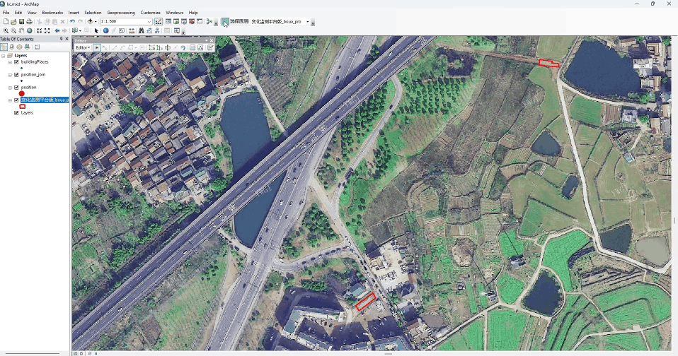

# ArcGIS-SAM Water & Land Extractor  
# ArcGIS-SAM 水体与地物提取工具

---

## 🌍 English Description

This ArcGIS Python Add-In tool integrates the **[Segment Anything Model (SAM)](https://github.com/facebookresearch/segment-anything)** by Facebook AI to enable **one-click semantic segmentation** of remote sensing imagery directly within **ArcMap**.

### 🔧 Features
- ✅ **Interactive Segmentation**: Click on water bodies, excavated areas, farmland, or other land features in the data view.
- ✅ **Real-time Inference**: Selected point is sent to the local SAM backend for mask prediction.
- ✅ **Auto Add to Layer**: The extracted polygon is automatically added to the currently active polygon feature layer.
- ✅ **User-Friendly**: No need to leave ArcMap — seamless integration with GIS workflow.

### 🛠️ Technical Overview
- **Frontend**: ArcGIS Python Add-In (Python 2.7, compatible with ArcMap 10.3+)
- **Backend**: SAM model server (PyTorch, `segment-anything` library)
- **Communication**: Local HTTP/gRPC or direct Python call
- **Output**: Polygon geometry added to current edit session

### 📦 Requirements
- ArcMap 10.3 or later
- Python 2.7 with `arcpy`
- SAM model weights (`sam_vit_h_4b8939.pth`)
- `segment-anything` Python package
- CUDA-enabled GPU (recommended)

### 📸 Screenshots
  

*ArcGIS Add-In toolbar and selection*

---

## 🇨🇳 中文说明

本工具是为 **ArcMap** 开发的 Python 插件，集成了 Meta（Facebook）发布的 **[Segment Anything Model (SAM)](https://github.com/facebookresearch/segment-anything)** 模型，实现在 **数据视图中点击一下**，即可自动提取水体、裸土、耕地等地物边界，并将结果添加到当前编辑的面图层中。

### 🔧 主要功能
- ✅ **交互式分割**：在影像上点击任意水体、挖掘区、农田等目标，自动提取完整范围。
- ✅ **本地推理**：SAM 模型运行在本地，保护数据隐私，无需上传云端。
- ✅ **自动入库**：提取结果以面要素形式直接添加到当前编辑的图层，支持继续编辑。
- ✅ **无缝集成**：无需切换软件，完全在 ArcMap 环境中完成操作。

### 🛠️ 技术架构
- **前端**：ArcGIS Python Add-In（Python 2.7，支持 ArcMap 10.1+）
- **后端**：SAM 模型服务（PyTorch + `segment-anything` 库）
- **通信方式**：本地 HTTP 请求 或 直接调用
- **输出**：生成的多边形自动加入当前图层

### 📦 系统要求
- ArcMap 10.1 或更高版本
- Python 2.7 环境（含 `arcpy`）
- SAM 模型权重文件（`sam_vit_h_4b8939.pth`）
- `segment-anything` Python 包
- 推荐使用 NVIDIA GPU 加速推理

### 📸 示例
  
*插件工具栏与点击选择*

---
